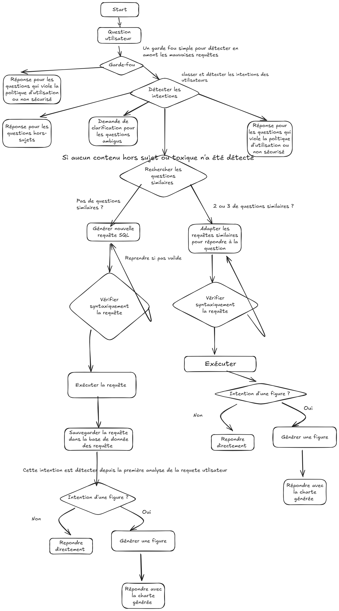

### Intelligence Artificielle pour l'Analyse des Élections Législatives Ivoiriennes


**Transformez vos questions en insights électoraux** — Interrogez les données des élections législatives ivoiriennes en langage naturel et obtenez des réponses précises avec visualisations.

---

## Démo Live

- **Application Streamlit** : [sqlragagent-iwdpwhwiqupwjpuk4mfqec.streamlit.app](https://sqlragagent-iwdpwhwiqupwjpuk4mfqec.streamlit.app/)
- **Monitoring LangSmith** : 
  - (https://smith.langchain.com/public/6fbc472b-7feb-4367-95f7-fc908dafe9a0/r)
  - (https://smith.langchain.com/public/827a1a2d-342d-445a-80a7-0c8e2ce5f8a1/r)
- **Code Source** : [github.com/beugre483/sql_rag_agent](https://github.com/beugre483/sql_rag_agent)

---

##  Ce que vous pouvez faire

Posez des questions en français sur les élections législatives et obtenez instantanément :

### 1.  Analyses Quantitatives
```
"Combien de sièges a gagné le RHDP ?"
"Quel est le taux de participation à Bouaké ?"
```

### 2. Visualisations Automatiques
L'agent génère automatiquement des graphiques adaptés :
- Diagrammes en barres pour les comparaisons
- Graphiques circulaires pour les répartitions
- Histogrammes pour les distributions

### 3.  Réponses Précises en SQL
Conversion automatique de vos questions en requêtes SQL sécurisées, exécutées sur une base de données structurée.

---

## Pourquoi  cette plateforme ?

###  Pour les Citoyens
- **Accès simplifié** — Pas besoin de parcourir des PDF
- **Réponses instantanées** — Obtenez l'information en quelques secondes
- **Visualisations claires** — Comprenez les tendances en un coup d'œil

###  Pour les Développeurs
- **Architecture moderne** — LangGraph pour orchestration robuste
- **Code maintenable** — Structure modulaire et bien documentée
- **Observabilité complète** — Traçage avec LangSmith

---

##  Architecture

ElectCI Agent repose sur une architecture d'agent intelligent orchestrée par **LangGraph** :

### Diagramme du Workflow LangGraph


*Graphe complet d'orchestration de l'agent avec LangGraph - Chaque nœud représente une étape du traitement*


```

### Composants Clés

**Agent SQL Intelligent**
- Classification automatique des intentions
- Génération de requêtes SQL sécurisées (SELECT uniquement)
- Few-shot dynamique avec base de requêtes validées

** Sécurité Multi-Couches**
- Garde-fou déterministe (détection de mots-clés interdits)
- Validation syntaxique et sémantique
- Colonnes normalisées pour robustesse orthographique

** Pipeline d'Extraction Intelligent**
- Extraction avec **LlamaExtract** (mode PER_TABLE_ROW)
- Base de données SQLite normalisée
- Vues SQL pré-calculées pour réduire la complexité

---

##  Installation & Démarrage

### Prérequis
- Python 3.11.9
- Poetry (gestionnaire de dépendances)
- Clés API : 
  - [Mistral AI](https://console.mistral.ai/) - Pour le modèle LLM
  - [Llama Cloud](https://docs.cloud.llamaindex.ai/llamaparse/getting_started/get_an_api_key) - Pour l'extraction PDF
  - [LangSmith](https://smith.langchain.com/) (optionnel) - Pour le monitoring

### Installation

```bash
# Cloner le repository
git clone https://github.com/beugre483/sql_rag_agent.git
cd sql_rag_agent

# Installer les dépendances avec Poetry
poetry install

# Activer l'environnement virtuel
poetry shell
```

### Configuration

Créez un fichier `.env` à la racine du projet :

```env
# APIs requises
LLAMA_CLOUD_API_KEY=your_llama_cloud_api_key_here
MISTRAL_API_KEY=your_mistral_api_key_here

# Monitoring (optionnel)
LANGSMITH_API_KEY=your_langsmith_api_key_here
LANGSMITH_TRACING=true
LANGSMITH_ENDPOINT=https://api.smith.langchain.com
LANGSMITH_PROJECT=ElectCI-Agent
```

**Où obtenir vos clés API ?**
- **Mistral AI** : [console.mistral.ai](https://console.mistral.ai/)
- **Llama Cloud** : [Documentation LlamaIndex](https://docs.cloud.llamaindex.ai/llamaparse/getting_started/get_an_api_key)
- **LangSmith** : [smith.langchain.com](https://smith.langchain.com/) (optionnel pour monitoring)

### Lancement

```bash
# Lancer l'application Streamlit
streamlit run app.py
```

L'application sera accessible sur `http://localhost:8501`

---

##  Comment ça marche ?

### 1. Extraction des Données (LlamaExtract)

Les résultats électoraux sont extraits des PDF officiels avec **LlamaExtract** en mode `PER_TABLE_ROW` :
- Extraction exhaustive ligne par ligne
-  Préservation de la structure hiérarchique (région → circonscription → candidat)
-  Typage strict avec schéma Pydantic
-  Contournement des biais positionnels des LLM

### 2. Base de Données Normalisée

Les données sont stockées dans SQLite avec :
- **Table `circonscriptions`** : métadonnées géographiques et statistiques
- **Table `candidats`** : résultats individuels par candidat
- **Colonnes normalisées** : `*_norm` pour robustesse orthographique (accents, casse, espaces)

### 3. Few-Shot Dynamique

L'agent utilise une **base de requêtes validées** pour :
- Rechercher des questions similaires via recherche par mots clés
- Adapter les requêtes existantes au lieu de générer du SQL from scratch
- Améliorer progressivement la qualité des réponses

### 4. Vues SQL Pré-Calculées

Des vues SQL abstraient la complexité :
- `vue_resultats_detailles` : jointures automatiques
- `vue_elus` : filtre sémantique (évite les erreurs)
- `vue_stats_regionales` : agrégations pré-calculées

### 5. Orchestration LangGraph

Chaque requête suit un workflow contrôlé :
1. **Garde-fou** : détection de requêtes interdites
2. **Classification** : intention analytique ou hors-sujet
3. **Génération SQL** : via few-shot ou génération nouvelle
4. **Validation** : syntaxe + sécurité (SELECT only)
5. **Exécution** : sur base SQLite sécurisée
6. **Visualisation** : génération automatique si pertinent

---

##  Exemples de Questions

### Requêtes d'Agrégation
```
"Combien de sièges ont été remportés par le PDCI ?"
"Quel est le nombre total de votes exprimés ?"
```

### Requêtes de Classement
```
"Quels sont les 5 partis ayant obtenu le plus de sièges ?"
"Classe les régions par taux de participation"
```

### Requêtes Géographiques
```
"Quels sont les résultats à Abidjan ?"
"Qui a gagné dans la région de Gbêkê ?"
```

### Requêtes de Comparaison
```
"Compare les scores du RHDP et du PDCI"
"Quelle région a le taux de participation le plus élevé ?"
```

---

## 🛠️ Technologies Utilisées

| Composant | Technologie |
|-----------|------------|
| **LLM** | Mistral Small (via API) |
| **Orchestration** | LangGraph |
| **Extraction PDF** | LlamaExtract + LlamaParse |
| **Base de Données** | SQLite |
| **Interface** | Streamlit |
| **Observabilité** | LangSmith |
| **Gestion Dépendances** | Poetry |

---

## Limitations Actuelles

### Connues et Acceptées
- **Pas de mémoire conversationnelle** : L'agent traite chaque question indépendamment (pas de contexte multi-tours)
- **Agent RAG non implémenté** : Les questions narratives ou contextuelles ne sont pas encore supportées
- **Robustesse orthographique limitée** : Les variations phonétiques complexes peuvent poser problème

### En Développement
- Intégration d'un agent RAG pour questions descriptives
- Mémoire conversationnelle courte et longue durée
- Support multilingue (anglais)
- Export des résultats (CSV, Excel)

---

## Observabilité & Monitoring

### Traçage avec LangSmith

Chaque requête est tracée end-to-end :
- Classification de l'intention
- Décision de routage
- Requête SQL générée
- Temps d'exécution
- Usage des tokens
- Erreurs éventuelles

→ **[Accédez au dashboard LangSmith public](https://smith.langchain.com/public/6fbc472b-7feb-4367-95f7-fc908dafe9a0/r)** pour analyser les performances en temps réel

## Contribution

Les contributions sont les bienvenues ! Pour contribuer :

1. Forkez le projet
2. Créez une branche (`git checkout -b feature/amelioration`)
3. Committez vos changements (`git commit -m 'Ajout fonctionnalité'`)
4. Poussez vers la branche (`git push origin feature/amelioration`)
5. Ouvrez une Pull Request

---

##  Contact & Support

- **Auteur** : Beugre Niamba Okess
- **GitHub** : [@beugre483](https://github.com/beugre483)
- **Issues** : [Signaler un bug](https://github.com/beugre483/sql_rag_agent/issues)

---


Ce projet est en version **v1
**Construit avec ❤️ pour faciliter l'accès aux données électorales ivoiriennes**

[🚀 Essayer l'app](https://sqlragagent-iwdpwhwiqupwjpuk4mfqec.streamlit.app/) | [📖  | [⭐ GitHub](https://github.com/beugre483/sql_rag_agent)
